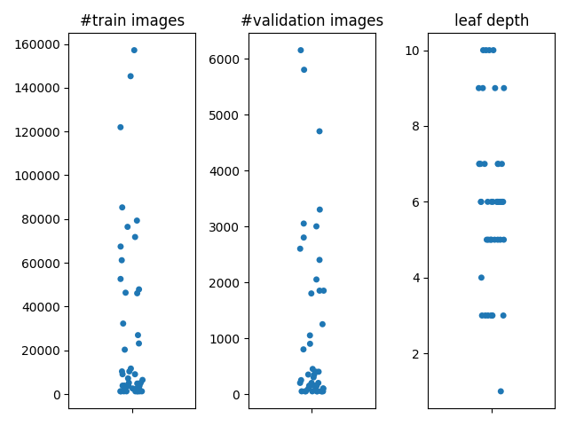

# Create Imagenet Metaclasses

Use `parse.py` to create metaclasses to ImageNet by automatically merging classes along the paths defined by WordNet.
Requires the files `data.noun` from [WordNet](https://wordnet.princeton.edu/) and either `imagenet_synsets.txt` (`ls ILSVRC2012_train > imagenet_synsets.txt`) or `imagenet_counts` (use `count_imagenet.py` and point to the ImageNet Folder), all three are provided here.

Outputs the following files:
- `out.yaml` the merged version of the synset tree.
- `class_dict.yaml` a dictionary mapping the old classes to the new merged classes.
- `leaf_info.txt` the resulting classes ordered by size.

Here is an example of the resulting sizes for a "bottom-up" merge

